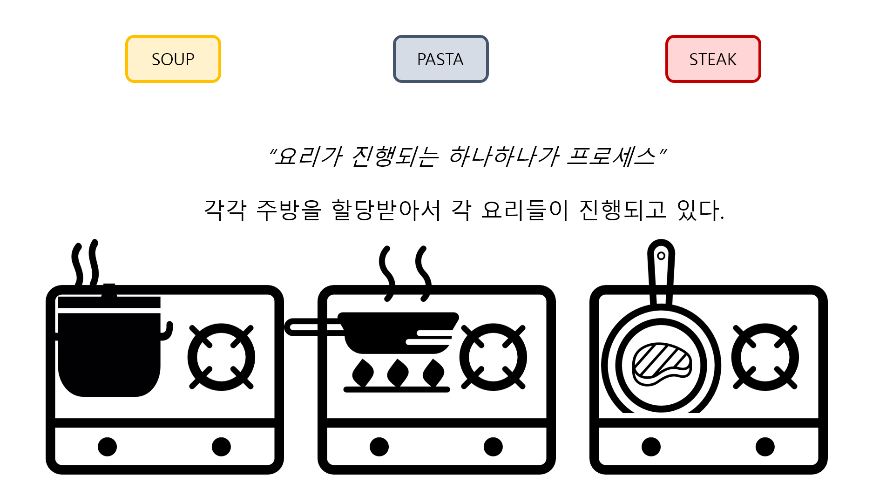

## [프로세스 #1](https://core.ewha.ac.kr/publicview/C0101020140318134023355997?vmode=f)

> 프로세스란 하나의 실행 중인 프로그램을 뜻한다. 먼저 프로세스는 프로세스의 현재 시점이 전체적으로 어떤 상태인지 나타내는 문맥context을 가지고 있다. 또한 프로세스는 상태state가 변경되며 수행되는데, CPU와 관련하여 어떠한 상태State 인지를 나타낼 수 있다.

 

### 프로세스의 개념

1. 정의

- Process: '실행 중인 프로그램'

 

2. 프로세스의 문맥(context)
   > '프로그램의 시작과 종료 사이의 어느 한 지점'으로, 프로그램이 무엇을 어떻게 실행했는지 혹은 프로그램의 현재 시점이 어떤 상태인지를 나타냄

- CPU 수행 상태를 나타내는 하드웨어 문맥  
  Program Counter  
  각종 register가 현재 어떤 값을 가지고 있는지
- 프로세스의 주소 공간(code, data, stack)  
  메모리와 관련  
  code, data, stack에 어떤 내용이 담겨있는지
- 프로세스 관련 커널 자료 구조  
  PCB(Process Control Block)  
  Kernel stack

 

### 프로세스의 상태 (Process State)

프로세스는 상태(state)가 변경되며 수행된다.

1. Running  
   CPU를 잡고 instruction을 수행 중인 상태
2. Ready  
   CPU를 기다리는 상태  
   다만, 메모리 등 다른 조건은 모두 만족한 상태임
3. Blocked (wait, sleep)  
   CPU를 주어도 당장 instruction을 수행할 수 없는 상태  
   Process 자신이 요청한 event(예를 들어, I/O)가 즉시 만족되지 않아 이를 기다리는 경우  
   또한 디스크에서 file을 읽어와야 하는 경우
4. Suspended (stopped)  
   외부적인 이유로 프로세스의 수행이 정지된 상태  
   프로세스는 동째로 디스크에 swap out 된다  
   사용자가 프로그램을 일시 정지시킨 경우(break key)  
   시스템이 여러 이유로 프로세스를 잠시 중단시킴  
   (메모리에 너무 많은 프로세스가 올라와 있을 때) 중기 스케쥴러가 메모리를 빼앗은 경우
5. New  
   프로세스가 생성 중인 상태
6. Terminated  
   수행(execution)이 끝난 상태  
   약간의 뒷정리가 필요한 상태

- 이미지 참고: '프로세스의 상태'
- Blocked와 Suspended의 차이  
  Blocked는 자신이 요청한 event가 만족되면 Ready, Suspended는 외부에서 resume해 주어야 Active

 

### Process Control Block(PCB)

1. 정의  
   운영체제가 각 프로세스를 관리하기 위해 프로세스당 유지하는 정보

2. 구성 요소(구조체로 유지)

- OS가 관리상 사용하는 정보  
  Process state, Process ID  
  scheduling information, priority

- CPU 수행 관련 하드웨어 값  
  Program counter, registers

- 메모리 관련  
  Code, data, stack의 위치 정보

- 파일 관련  
  Open file descriptors

 

### 문맥 교환 (Context Switch)

1. 정의  
   CPU를 한 프로세스에서 다른 프로세스로 넘겨주는 과정

2. CPU가 다른 프로세스에게 넘어갈 때 운영체제는 다음을 수행한다.

- CPU를 내어주는 프로세스의 상태를 그 프로세스의 PCB에 저장  
  이는 이후에 CPU를 다시 얻어올 때 과거에 CPU를 내어주던 그 시점의 문맥을 기억해두었다가 그 시점부터 다시 시작할 수 있도록 해준다.
- CPU를 새롭게 얻는 프로세스의 상태를 PCB에서 읽어옴

3. System call이나 Interrupt 발생시 반드시 content switch가 일어나는 것은 아님  
   ....? 이해불가.....................  
   시스템콜..  
   타이머인터럽트 CPU를 다른 프로세스에 넘기기 위한 의도를 가지는 애..얘는 문맥 교환이 일어난거라고???위의 경우인듯

4. timer interrupt 혹은 I/O 요청 systemcall의 경우는 문맥교환이 일어난 것

 

### 프로세스를 스케줄링하기 위한 큐

1. Job queue  
   현재 시스템 내에 있는 모든 프로세스의 집합
2. Ready queue  
   현재 메모리 내에 있으면서 CPU를 잡아서 실행되기를 기다리는 프로세스의 집합
3. Device queue  
   I/O device의 처리를 기다리는 프로세스의 집합
4. 프로세스들은 각 큐들을 오가며 수행된다

### 스케줄러 (Scheduler)

1. Long-term scheduler (장기 스케쥴러 or job scheduler)
   > 프로세스가 시작new에서 ready 상태로 넘어가는 과정에는 메모리memory에 올라가는 것에 대해 admitted 되어야 하는데,
   > 해당 프로세스에 메모리를 줄지 안줄지 admit하는 것이 장기 스케줄러의 역할이다.

- 시작 프로세스 중 어떤 것들을 ready queue로 보낼지 결정
- 프로세스에 memory(및 각종 자원)을 주는 문제
- degree of Multiprogramming을 제어
- time sharing system에는 보통 장기 스케줄러가 없음(무조건 ready)

 

2. Short-term scheduler (단기 스케줄러 or CPU scheduler)

- 어떤 프로세스를 다음 번에 running 시킬지 결정
- 프로세스에 CPU를 주는 문제
- 충분히 빨라야 함(millisecond 단위)

 

3. Medium-Term scheduler (중기 스케줄러 or Swapper)

- 여유 공간 마련을 위해 프로세스를 통째로 메모리에서 디스크로 쫓아냄
- 프로세스에게서 memory를 뺏는 문제
- degree of Multiprogramming을 제어 (현재 시스템에서는 장기 스케줄러가 없고 무조건 ready 상태로 올리는데, 이때 중기 스케줄러가 메모리에 올라가있는 전체 프로세스 수degree of Multiprogramming를 조정함)

 

## [프로세스 #2](https://core.ewha.ac.kr/publicview/C0101020140321141759959993?vmode=f)

### 질문 답변 > [1, 2장 운영체제 개요 및 컴퓨터시스템의 구조](/운영체제/1,-2장-운영체제-개요-및-컴퓨터시스템의-구조.md)

- 동기식 입출력과 비동기식 입출력?

### Thread

1. 개념

- 하나의 프로세스 내부에 CPU 수행 단위가 여러 개 있는 것
- 따라서 thread들은 (하나의 프로세스마다 주어진) 컴퓨터 자원 전체를 공유  
  (\*프로세스는 컴퓨터의 자원을 분할해서 할당받음)
- thread는 CPU를 수행하는 단위
- lightweight process라고 부르기도 함

2. Thread의 구성

- program counter
- register set
- stack space
- 즉 CPU 수행과 관련된 것들은 별도로 가지고 있음

3. Thread가 동료 thread와 공유하는 부분('task')

- code section
- data section
- OS resources
- 하나의 프로세스 안에 스레드가 여러 개 있으면, task는 하나

4. 장점

- 다중 스레드로 구성된 태스크 구조에서는 하나의 서버 스레드가 blocked(waiting) 상태인 동안에도 동일한 태스크 내의 다른 스레드가 실행(running)되어 빠른 처리를 할 수 있다.
- 동일한 일을 수행하는 다중 스레드가 협력하여 높은 처리율(throughput)과 성능 향상을 얻을 수 있다.
- 스레드를 사용하면 병렬성을 높일 수 있다.
- 하나의 브라우저(프로세스)에서 파일을 다운 받으면서 검색도 할 수 있게 됨

5. 단점

- 프로세스 안에서 공유되는 변수에 여러 스레드가 접근하면 예상한 값이 나오지 않을 수 있다.
- 예를 들어 하나의 프로세스 안에 int형 num 변수를 공유하고, 이에 접근할 때마다 1씩 증가한다고 가정해보자. 두 개의 스레드가 num에 접근할 때마다 1씩 증가할 것이라고 예상할 수 있지만, 두 개의 스레드가 '동시에' 접근할 경우엔 실행이 한번만 된 것처럼 num 변수는 +2가 아닌 +1만 증가하게 된다.
- 따라서 디버깅, 코드짜기에 어려움이 있을 수 있다.

 

## 정리

- Process
  
  비유를 들어 설명하자면, 뷔페를 갔다고 상상해보자.
  뷔페 안에는 스프, 파스타, 스테이크 등 여러 음식을 만드는 곳이 있다.
  각각의 영역은 각각 주방을 할당받아서 요리를 하고 있다.
  컴퓨터 안에서의 프로세스도 이와 비슷하다.
  물론 컴퓨터는 굉장히 빠르게 실행되서 동시에 실행되는 것처럼 보인다는 점만 감안하자.
  정리하자면 이러한 각각의 조리대에서 음식을 만드는 것이 하나의 프로세스가 된다.

   

- Thread  
   
  이제는 스테이크 존만 자세히 들여봐보자.
  스테이크 존이라는 프로세스에서 고기를 굽고 소스를 끓인다.
  이거 하나하나를 스레드라고 부르는 것  
   “하나의 프로세스에서 여러 스레드가 동시에 진행되는 꼴”  
   단점이 있다면, 하나의 프로세스한테 주어진 컴퓨터 자원을 공유한다.
  즉, 고기 굽고 소스 끓이는
  양쪽에서 올리브오일이 필요해서 접근을 했는데,
  동시에 접근을 하면 올리브 오일의 전체 양이 ‘2’가 줄어드는게 아니고 ‘1’만 줄어들게 된다. 현실에선 재고상의 문제가 발생하는 꼴이다.

 

## 프로세스 #3

### Single and Multithreaded Processes

-

### Benefits of Threads

-

### Implementation of Threads

-
