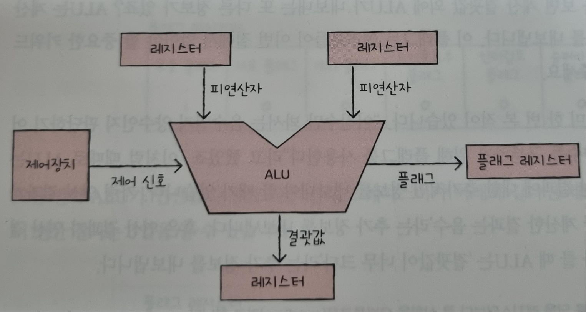
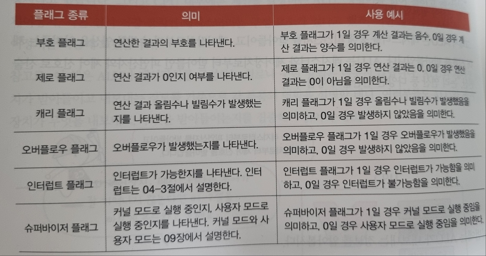
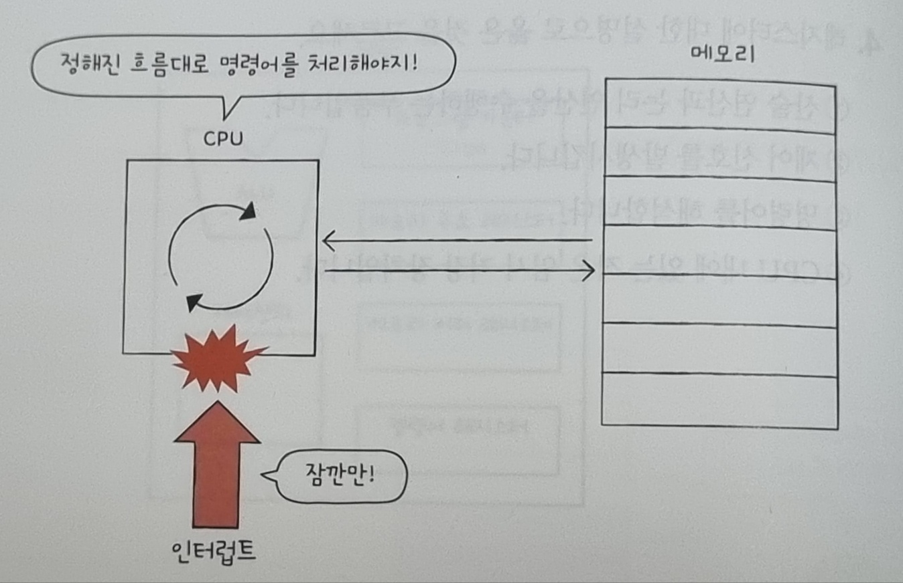

## 개요

- ALU와 제어장치에 대해 학습한다.
- 레지스터의 종류와 역할에 대해 학습한다.
- 명령어 사이클을 이해한다.
- 인터럽트의 개념을 이해한다.

## ALU와 제어장치

### ALU

ALU는 레지스터를 통해 피연산자를 받아들이고, 제어장치로부터 수행할 연산을 알려주는 제어 신호를 받아들인다. ALU는 레지스터와 제어장치로부터 받아들인 피연산자와 제어 신호로 산술 연산, 논리 연산 등 다양한 연산을 수행한다.

 

ALU는 계산 결과와 함께 플래그를 내보낸다. 즉, 연산 결과에 대한 추가적인 상태 정보인 플래그를 함께 내보낸다. 그리고 플래그는 플래그 레지스터라는 레지스터에 저장된다.

 

### 제어장치

> 제어장치는 제어 신호를 내보내고, 명령어를 해석하는 부품이다. 그리고 제어신호는 컴퓨터 부품들을 관리하고 작동시키기 위한 일종의 전기 신호이다.

아래의 사진을 바탕으로 이해해보자.

1. 제어장치가 받아들이는 정보

- 제어장치는 클럭 신호를 받아들인다.  
  클럭이란 컴퓨터의 모든 부품을 일사불란하게 움직일 수 있게 하는 시간 단위이다.클럭의 "똑-딱-똑-딱" 주기에 맞춰 한 레지스터에서 다른 레지스터로 데이터가 이동되거나, ALU에서 연산이 수행되거나, CPU가 메모리에 저장된 명령어를 읽어 들이는 것이다.
- 제어장치는 '해석해야 할 명령어'를 받아들인다.  
  CPU가 해석해야 할 명령어는 명령어 레지스터에 저장된다. 명령어 레지스터로부터 해석할 명령어를 받아들여 해석한 뒤, 제어 신호를 발생시켜 컴퓨터 부품들에 수행해야 할 내용을 알려준다.
- 제어장치는 플래그 레지스터 속 플래그 값을 받아들인다.
- 제어장치는 시스템 버스, 그중에서 제어 버스로 전달된 제어 신호를 받아들인다.

2. 제어장치가 내보내는 정보

- CPU 외부에 전달하는 제어 신호  
  즉, 제어 버스로 제어 신호를 내보낸다는 말과 같다. 이러한 제어 신호에는 크게 메모리에 전달하는 제어 신호와 입출력장치에 전달하는 제어 신호가 있다.
- CPU 내부에 전달하는 제어 신호  
  ALU에 전달하는 제어신호와 레지스터에 전달하는 제어 신호가 있다. ALU에는 수행할 연산을 지시하기 위해, 레지스터에는 레지스터 간데 데이터를 이동시키거나 레지스터에 저장된 명령어를 해석하기 위해 제어 신호를 내보내다.

 

## 레지스터

> 프로그램 속 명령어와 데이터는 실행 전후로 반드시 레지스텅 저장된다. 따라서 레지스터에 저장된 값만 잘 관찰해도 프로그램의 실행 흐름을 파악할 수 있다.

### 반드시 알아야 할 레지스터

> 114페이지부터 117페이지

1. 프로그램 카운터  
   메모리에서 가져올 명령어의 주소, 즉 메모리에서 읽어 들일 명령어의 주소를 저장한다. 프로그램 카운터를 명령어 포인터라고 부르는 CPU도 있다.
2. 명령어 레지스터  
   해석할 명령어, 즉 방금 메모리에서 읽어 들인 명령어를 저장하는 레지스터이다. 제어장치는 명령어 레지스터 속 명령어를 받아들이고 이를 해석한 뒤 제어 신호를 내보낸다.
3. 메모리 주소 레지스터  
   메모리의 주소를 저장하는 레지스터이다. CPU가 읽어 들이고자 하는 주소 값을 주소 버스로 보낼 때 ㅁ모리 주소 레지스터를 거치게 된다.
4. 메모리 버퍼 레지스터(메모리 데이터 레지스터)  
   메모리와 주고받을 값(데이터와 명령어)을 저장하는 레지스터이다. 즉, 메모리에 쓰고 싶은 값이나 메모리로부터 전달받을 값은 메모리 버퍼 레지스터를 거친다.
5. 범용 레지스터  
   다양하고 일반적인 상황에서 자유롭게 사용할 수 있는 레지스터이다. 메모리 버퍼 레지스터는 데이터 버스로 주고받을 값만 저장하고, 메모리 주소 레지스터는 주소 버스로 내보낼 주소값만 저장한다. 반면, 범용 레지스터는 데이터와 주소를 모두 저장할 수 있다.
6. 플래그 레지스터  
   ALU 연산 결과에 따른 플래그를 플래그 레지스터에 저장한다. 이는 연산 결과 또는 CPU 상태에 대한 부가적인 정보를 저장한다.

 

### 특정 레지스터를 이용한 주소 지정 방식

> 스택 포인터는 스택 주소 지정 방식이라는 주소 지정 방식에 사용되고, 프로그램 카운터와 베이스 레지스터는 변위 주소 지정 방식이라는 주소 지정 방식에 사용된다.

### (1) 스택 주소 지정 방식

스택과 스택 포인터를 이용한 주소 지정 방식이다. 스택은 가장 최근에 저장하는 값부터 꺼낼 수 있다. 여기서 스택 포인터란 스택의 꼭대기를 가리키는 레지스터이다. 즉, 스택 포인터는 스택에 마지막으로 저장한 값의 위치를 저장하는 레지스터이다.

그렇다면 이 스택은 어디에 있는 것일까? 스택은 메모리 안에 있다. 정확히는 메모리 안에 스택처럼 사용할 영역이 정해져 있다. 이를 스택 영역이라고 한다.

### (2) 변위 주소 지정 방식

오퍼랜드 필드의 값(변위)과 특정 레지스터의 값을 더하여 유효 주소를 얻어내는 주소 지정 방식이다. 그래서 변위 주소 지정 방식을 사용하는 명령어는 연산 코드 필드, 어떤 레지스터의 값과 더할지를 나타내는 레지스터 필드, 그리고 주소를 담고 있는 오퍼랜드 필드가 있다.

이때 변위 주소 지정 방식은 오퍼랜드 필드의 주소와 어떤 레지스터를 더하는지에 따라 상대 주소 지정 방식, 베이스 레지스터 주소 지정 방식 등으로 나뉜다.

- 상대 주소 지정 방식  
  오퍼랜드와 프로그램 카운터의 값을 더하여 유효 주소를 얻는 방식이다.  
  상대 주소 지정 방식은 프로그래밍 언어의 if문과 유사하게 모든 코드를 실행하는 것이 아닌, 분기하여 특정 주소의 코드를 실행할 때 사용된다.
- 베이스 레지스터 주소 지정 방식  
  오퍼랜드와 베이스 레지스터의 값을 더하여 유효 주소를 얻는 방식이다. 여기서 베이스 레지스터는 '기준 주소', 오퍼랜드는 '기준 주소로부터 떨어진 거리'로서의 역할을 한다.  
  즉, 베이스 레지스터 속 기준 주소로부터 얼마나 떨어져 있는 주소에 접근할 것인지를 연산하여 유효 주소를 얻어내는 방식이다.

 

## 명령어 사이클과 인터럽트

> CPU가 하나의 명령어를 처리하는 과정에는 어떤 정해진 흐름이 있고, CPU는 그 흐름을 반복하며 명령어들을 처리해 나간다. 이렇게 하나의 명령어를 처리하는 정형화된 흐름을 명령어 사이클이라고 한다. CPU는 정해진 흐름에 따라 명령어를 처리해 나가지만, 간혹 이 흐름이 끊어지는 상황이 발생한다. 이를 인터럽트라고 한다.

### 명령어 사이클

우리가 실행하는 프로그램은 수많은 명령어로 이루어져 있고, CPU는 이 명령어들을 하나씩 실행한다. 이때 프로그램 속 각각의 명령어들은 일정한 주기가 반복되며 실행되는데, 이 주기를 명령어 사이클이라고 한다. 즉, 프로그램 속 각각의 명령어들은 명령어 사이클이 반복되며 실행된다.

- 인출 사이클 (메모리에 있는 명령어를 CPU로 가지고 오는 단계) <->  
  실행 사이클 (CPU로 가져온 명령어를 실행하는 단계. 즉, 제어장치가 명령어 레지스터에 담긴 값을 해석하고, 제어 신호를 발생시키는 단계)
- 간접 사이클  
  간접 주소 지정 방식처럼 명령어를 인출하여 CPU로 가져왔다 하더라도 곧바로 실행할 수 없는 경우  
  명령어를 인출하여 CPU로 가져왔다 하더라도 바로 실행 사이클에 돌입할 수 없다. 명령어를 실행하기 위해서는 메모리 접근을 한 번 더 해야 하기 때문이다.

### 인터럽트

> CPU가 수행 중인 작업은 방해를 받아 잠시 중단될 수 있는데, 이렇게 CPU의 작업을 방해하는 신호를 인터럽트라고 한다.

- 동기 인터럽트  
  CPU에 의해 발생하는 인터럽트이다.  
  CPU가 명령어들을 수행하다가 예상치 못한 상황에 마주쳤을 때  
  가령 CPU가 실행하는 프로그래밍상의 오류와 같은 예외적인 상황에 마주쳤을 때 발생  
  이런 점에서 동기 인터럽트는 예외라고 부른다.
- 비동기 인터럽트  
  입출력 장치에 의해 발생하는 인터럽트  
  입출력장치에 의한 비동기 인터럽트는 세탁기 완료 알림, 전자레인지 조리 완료 알림과 같은 알림 역할을 한다.  
  일반적으로 비동기 인터럽트를 인터럽트라 칭하기도 한다. (다만 이 책에서는 용어의 혼동을 방지하기 위해 하드웨어 인터럽트라는 용어를 사용)
  - 하드웨어 인터럽트  
    알림과 같은 인터럽트
