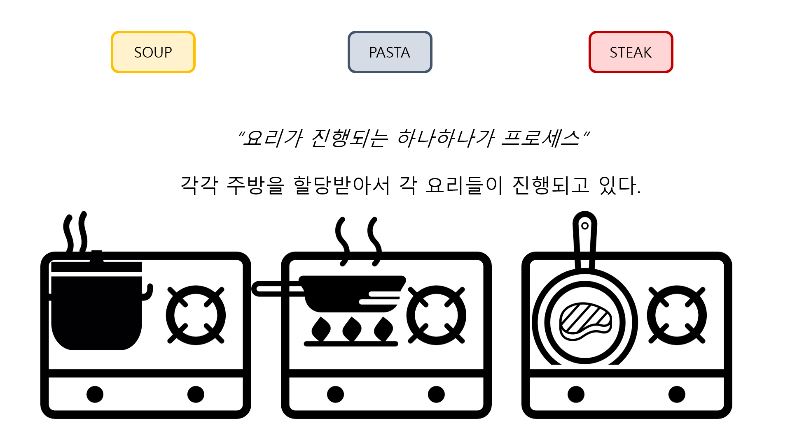
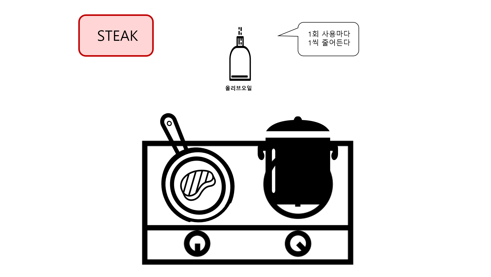

## 정리

### Process

   
 
비유를 들어 설명하자면, 뷔페를 갔다고 상상해보자.    
뷔페 안에는 스프, 파스타, 스테이크 등 여러 음식을 만드는 곳이 있다.     
각각의 영역은 각각 주방을 할당받아서 요리를 하고 있다.     
컴퓨터 안에서의 프로세스도 이와 비슷하다.    
물론 컴퓨터는 굉장히 빠르게 실행되서 동시에 실행되는 것처럼 보인다는 점만 감안하자.    
정리하자면 이러한 각각의 조리대에서 음식을 만드는 것이 하나의 프로세스가 된다.

   

### Thread

   
 
이제는 스테이크 존만 자세히 들여봐보자.     
스테이크 존이라는 프로세스에서 고기를 굽고 소스를 끓인다.    
이거 하나하나를 스레드라고 부르는 것      
“하나의 프로세스에서 여러 스레드가 동시에 진행되는 꼴”      
단점이 있다면, 하나의 프로세스한테 주어진 컴퓨터 자원을 공유한다.    
즉, 고기 굽고 소스 끓이는 
양쪽에서 올리브오일이 필요해서 접근을 했는데,    
동시에 접근을 하면 올리브 오일의 전체 양이 ‘2’가 줄어드는게 아니고 ‘1’만 줄어들게 된다.     
현실에선 재고상의 문제가 발생하는 꼴이다.
