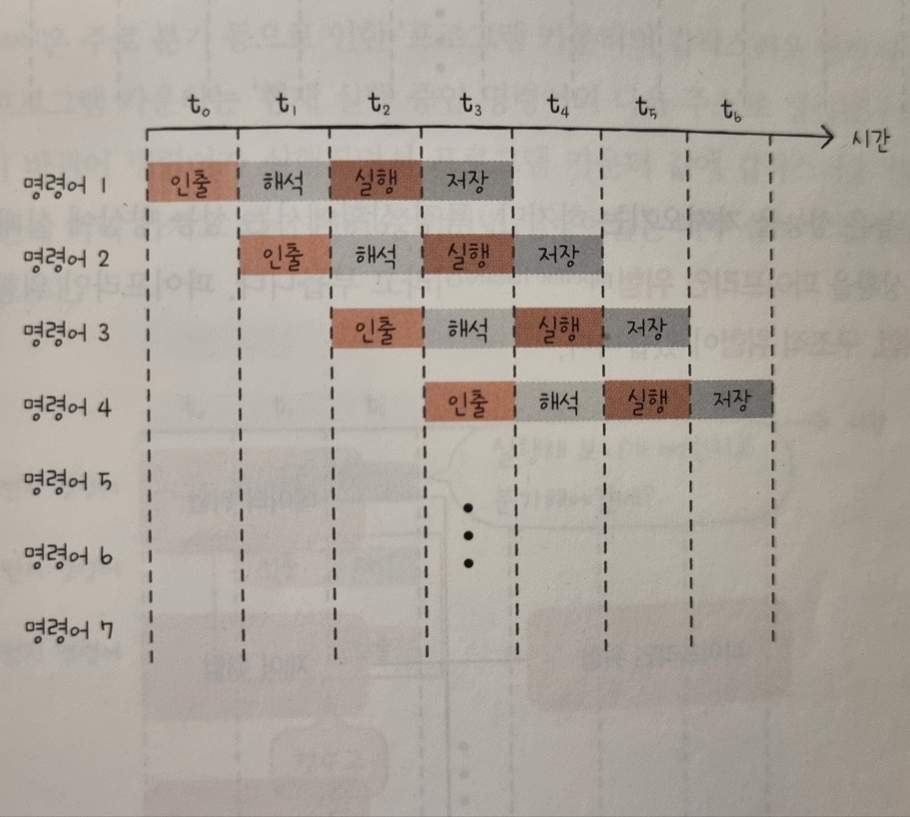

## 개요

- 빠른 CPU를 위한 설계 기법을 학습한다.
- 빠른 CPU를 위한 명령어 병렬 처리 기법을 학습한다.
- RISC와 CISC의 차이에 대해 이해한다.

 

## 빠른 CPU를 위한 설계 기법

### 클럭

- 클럭 속도가 높은 CPU는 빠르게 동작
- 클럭 속도는 헤르츠(Hz) 단위로 측정
- 클럭 속도를 무작정 높이면 발열 문제가 더 심각해짐
- 따라서 클럭 속도만으로 CPU의 성능을 올리는 것에는 한계가 있음

 

### 코어와 멀티코어

- CPU의 코어와 스레드 수를 늘리면 CPU의 성능을 높일 수 있음
- 코어란, CPU 내에서 명령어를 실행하는 부품으로 여러 개 있을 수 있음
  - 즉, 코어는 '명령어를 실행하는 부품'이고, CPU는 '명령어를 실행하는 부품을 여러 개 포함하는 부품'
  - 오늘날 CPU는 많은 기술적 발전을 거듭하면서 위와 같이 재해석되고 있음
- 코어를 여러 개 포함하고 있는 CPU를 멀티코어(multi-core) CPU 또는 멀티코어 프로세서라고 부름
- 이는 CPU 내에 명령어를 처리하는 일꾼이 여러 명 있는 것
- CPU의 연산 속도가 꼭 코어 수에 비례하여 증가하지 않음. 코어마다 처리할 명령어들을 얼마나 적절하게 분배하느냐가 중요함.

 

### 스레드와 멀티스레드

- 스레드에는 CPU에서 사용되는 하드웨어적 스레드가 있고, 프로그램에서 사용되는 소프트웨어적 스레드가 있음
- 하드웨어적 스레드는 '하나의 코어가 동시에 처리하는 명령어 단위'를 의미
  - 여러 스레드를 지원하는 CPU는 하나의 코어로도 여러 개의 명령어를 동시에 실행
  - 2코어 4스레드란 '명령어를 실행하는 부품을 두 개 포함하고, 한 번에 네 개의 명령어를 처리'할 수 있는 CPU.
  - 즉 코어 하나당 두 개의 하드웨어 스레드를 처리
  - 하나의 코어로 여러 명령어를 동시에 처리하는 CPU를 멀티스레드 프로세서 또는 멀티스레드 CPU라고 함
- 소프트웨어적 스레드는 '하나의 프로그램에서 독립적으로 실행되는 단위'를 의미

 

## 명령어 병렬 처리 기법

> 빠른 CPU를 만들려면 높은 클럭 속도에 멀티코어, 멀티스레드를 지원하는 CPU를 만드는 것도 중요하지만, CPU가 놀지 않고 시간을 알뜰하게 쓰며 작동하게 만드는 것도 중요하다. 대표적인 명령어 병렬 처리 기법에는 명령어 파이프 라이닝, 슈퍼스칼라, 비순차적 명령어 처리가 있다.

### 명령어 파이프라인

- 마치 공장 생산 라인과 같이 명령어들을 명령어 파이프라인에 넣고 동시에 처리하는 기법을 명령어 파이프라이닝이라고 함
- 파이프라이닝이 높은 성능을 가져오기는 하지만, 특정 상황에서는 성능 향상에 실패하는 경우도 있음. 이러한 상황을 파이프라인 위험이라고 부름
  - 데이터 위험
  - 제어 위험
  - 구조적 위험

 

### 슈퍼스칼라

- CPU 내부에 여러 개의 명령어 파이프라인을 포함한 구조를 슈퍼스칼라라고 함.
- 명령어 파이프라인을 하나만 두는 것이 마치 공장 생산 라인을 한 개 두는 것과 같다면, 슈퍼스칼라는 공장 생산 라인을 여러 개 두는 것과 같음.

 

### 비순차적 명령어 처리

- 비순차적 명령어 처리 기법은 명령어들을 순차적으로 실행하지 않는 기법. 즉 명령어의 '합법적인 새치기'

 

## CISC와 RISC

> 명령어 파이프라이닝과 슈퍼스탈라 기법을 실제로 CPU에 적용하려면 명령어가 파이프라이닝에 최적화되어 있어야 함. 쉽게 말해 CPU가 파이프라이닝과 슈퍼스칼라 기법을 효과적으로 사용하려면 CPU가 인출하고 해석하고 실행하는 명령어가 파이프라이닝 하기 쉽게 생겨야 함.
>
> '파이프라이닝 하기 쉬운 명령어'와 관련해 CPU의 언어인 'ISA'와 각기 다른 성격의 ISA를 기반으로 설계된 CISC와 RISC를 학습하겠음.

### ISA

- CPU의 언어이자 하드웨어가 소프트웨어를 어떻게 이해할지에 대한 약속

 

### CISC

- 복잡하고 다양한 수의 가변 길이 명령어 집합을 활용

### RISC

- 단순하고 적은 수의 고정 길이 명령어 집합을 활용
- 짧고 규격화된 명령어를 활용하기에 명령어 파이프라이닝에 유리
