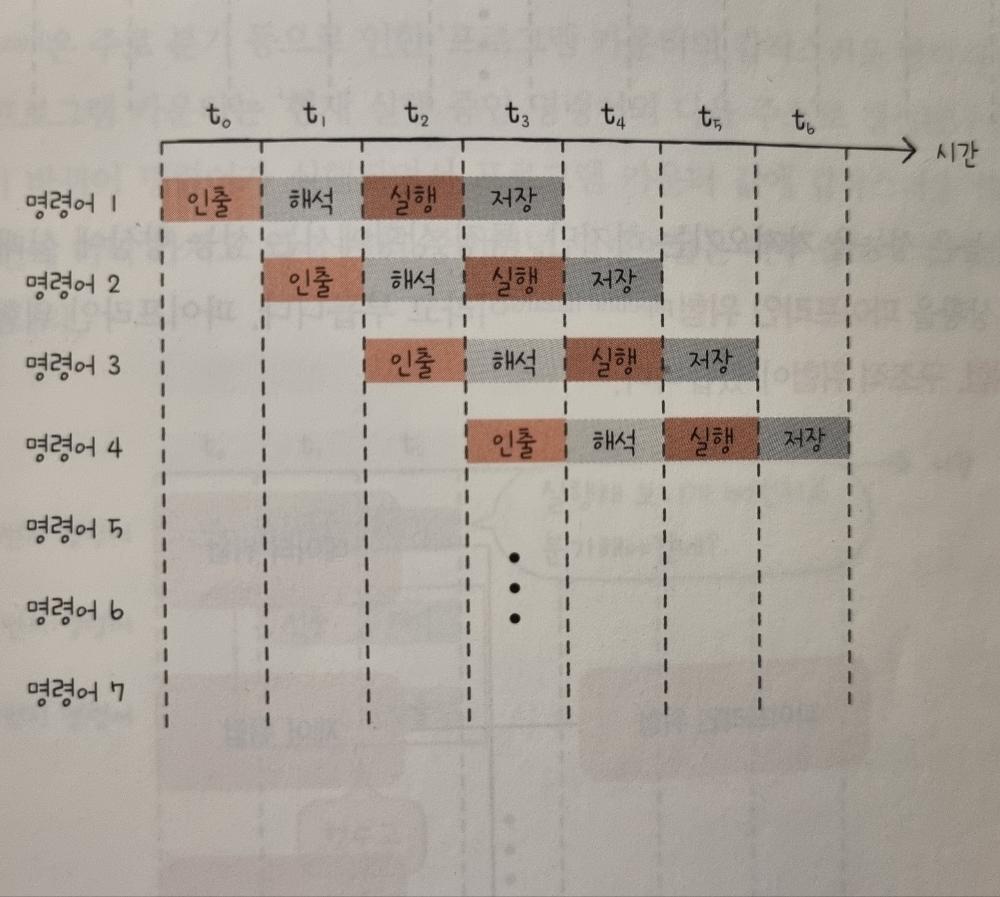

1. ( )는 사람이 이해하고 작성하기 쉽게 만들어진 언어이고, ( )는 컴퓨터가 직접 이해하고 실행할 수 있는 언어이다.

2. 저급 언어는 0과 1로 이루어진 명령어로 구성된 ( )와 기계어를 사람이 읽기 편한 형태로 번역한 ( )가 있다.

3. ( )는 연산에 사용할 데이터 또는 연산에 사용할 데이터가 저장된 위치를 의미한다.

4. ( )는 클럭, 현재 수행할 명령어, 플래그, 제어 신호를 받아들인다.

5. 다음은 명령어 병렬 처리 기법 중의 하나이다. 사진과 같이 작동하는 명령어 처리 기법은 무엇인가?
   

6. 다음은 레지스터에 대한 설명이다. 어떤 레지스터에 대한 설명인가?

   > 다양하고 일반적인 상황에서 자유롭게 사용할 수 있는 레지스터이다. 메모리 버퍼 레지스터는 데이터 버스로 주고받을 값만 저장하고, 메모리 주소 레지스터는 주소 버스로 내보낼 주소값만 저장한다. 반면, 범용 레지스터는 데이터와 주소를 모두 저장할 수 있다.

7. 파이프라이닝이 높은 성능을 가져오기는 하지만, 특정 상황에서는 성능 향상에 실패하는 경우도 있다. 이러한 상황을 파이프라인 위험이라고 부르는데, 이와 관련된 용어 3가지는 무엇인가?

 
 
 
 
 
 
 

1. 고급 언어, 저급언어
2. 기계어, 어셈블리어
3. 오퍼랜드
4. 제어장치
5. 명령어 파이프라인
6. 범용 레지스터
7. 데이터 위험, 제어 위험, 구조적 위험
